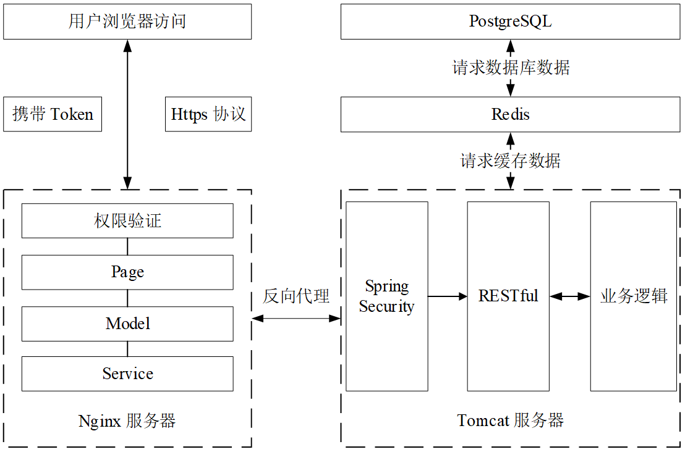
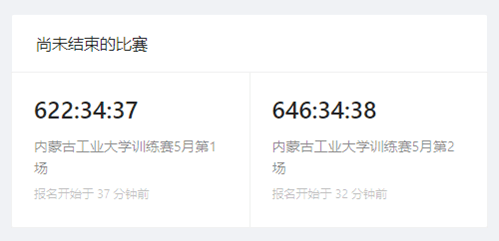
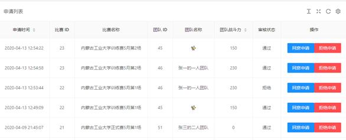
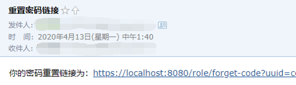
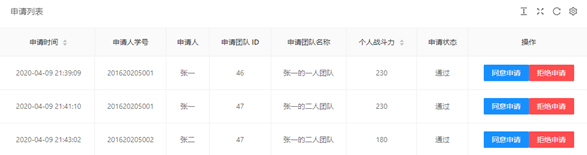

# 前言

学科竞赛管理系统前端部分。

学科竞赛训练管理系统的前端使用 React 创建高可复用的组件，通过声明式编写复杂的 UI，使用 Nginx 作为 Web 服务器，反向代理以解决跨域问题；后端使用 Spring Boot 以约定式配置快速搭建项目，使用 Spring Security 保证应用程序的安全，使用 Spring Data JPA 访问 PostgreSQL，使用 Redis 作为系统缓存。

学科竞赛训练管理系统是我的毕业设计。本文内容因为删掉了与我个人和学校有关的隐私内容，测试和系统设计可能描述的不是很完整。

因为是用 3 天就完成了 90% 前后端开发工作，因此代码不是很简洁，出现了大量重复、冗余代码，尽情谅解。

[后端地址](https://github.com/dormirr/galop-server)

# 系统介绍

针对目前高校举办学科竞赛所遇到的问题，本系统主要设计六个模块，分别是通知模块、战斗力模块、比赛模块、报名模块、角色模块和团队模块。



# 安装与使用教程

## 安装

### 服务器环境

服务器需要安装如表所示的软件。

|  名称   |  版本   |               |
| :-----: | :-----: | :-----------: |
|  Nginx  |  1.16   |               |
| OpenJDK |   11    |               |
| 数据库  | Redis 5 | PostgreSQL 12 |
| Node.js |   12    |               |

### 客户端环境

安装 IE 11 或所有现代浏览器。

### Nginx 配置

```xml
http {
    include       mime.types;
    default_type  application/octet-stream;

    sendfile        on;

    keepalive_timeout  65;

    server {
        listen 80;

        gzip on;
        gzip_min_length 1k;
        gzip_comp_level 9;
        gzip_types text/plain application/javascript application/x-javascript text/css application/xml text/javascript application/x-httpd-php image/jpeg image/gif image/png;
        gzip_vary on;
        gzip_disable "MSIE [1-6]\.";

        root D:/AntDesignProjects/galop-web/dist;

        location / {
            try_files $uri $uri/ /index.html;
            rewrite ^/(.*)$ https://localhost/$1 permanent;
        }        
        location /api/ {
            proxy_pass https://localhost:8080/;
            proxy_set_header   X-Forwarded-Proto $scheme;
            proxy_set_header   X-Real-IP         $remote_addr;
        }
    }

    server {
        listen 443 ssl http2 default_server;

        ssl_certificate D:/IdeaProjects/galop-server/core-module/src/main/resources/galop.crt;
        ssl_certificate_key D:/IdeaProjects/galop-server/core-module/src/main/resources/galop.key;
        ssl_session_timeout  5m;
        ssl_protocols TLSv1 TLSv1.1 TLSv1.2;
        ssl_ciphers AESGCM:ALL:!DH:!EXPORT:!RC4:+HIGH:!MEDIUM:!LOW:!aNULL:!eNULL;
        ssl_prefer_server_ciphers   on;
        
        root D:/AntDesignProjects/galop-web/dist;

        location / {
            try_files $uri $uri/ /index.html;
        }
        location /api/ {
            proxy_pass https://localhost:8080/;
            proxy_set_header   X-Forwarded-Proto $scheme;
            proxy_set_header   Host              $http_host;
            proxy_set_header   X-Real-IP         $remote_addr;
        }
    }
}
```

其中前端文件位置可以在 `root` 处定义，域名可以在 `location` 处定义，证书位置可以在 `ssl_certificate` 和 `ssl_certificate_key` 处定义，可自行修改。

### 数据库配置

#### Redis 配置

```yaml
spring:
  data:
    redis:
      repositories:
        enabled: true

  redis:
    # 数据库索引
    database: 0
    host: 127.0.0.1
    port: 6379
    password:
    # 连接超时时间
    timeout: 5000
```

可自行修改数据库服务器 IP 地址、端口号和密码。

#### PostgreSQL 配置

首先需要使用 `galop_20200502.sql` 文件创建数据库，创建后进行如下数据库配置。

```yaml
spring:
  datasource:
    druid:
      url: jdbc:postgresql://localhost:5432/galop
      username: postgres
      password: 123456
```

可自行修改数据库服务器 IP 地址、端口号、账号和密码。

### 其他配置

可自行修改 `application.yml` 中如表所示配置。

|       名称        |                 默认值                 |      备注      |
| :---------------: | :------------------------------------: | :------------: |
| Excel模板存储位置 |  `D:\IdeaProjects\galop-server\file\`  |      可选      |
|     邮箱配置      |                                        | 默认为空，必填 |
|   头像存储位置    | `D:\IdeaProjects\galop-server\avatar\` |      可选      |

### 建议配置

建议将前端代码放置在`D:\AntDesignProjects` 文件夹下，将后端代码放置在 `D:\IdeaProjects` 文件夹下。这样可以直接使用自带的默认配置，仅需配置环境与邮箱。

配置完成后，前端需要执行 `npm install` 安装依赖，然后执行 `umi build` 编译。后端需要执行 `mvn clean install` 打包并发布到本地仓库。

## 运行

### 启动

运行 Nginx 服务器，Redis 和 PostgreSQL，然后运行编译后的 jar 包即可启动。

Windows 10 上具体操作如表所示。

|                            命令                            |          备注          |
| :--------------------------------------------------------: | :--------------------: |
|                      启动 PowerShell                       |                        |
|              执行 `cd D:\Nginx\nginx-1.16.1\`              | 切换到 Nginx 安装目录  |
|                    `start  ./nginx.exe`                    |   启动 Nginx 服务器    |
|                         启动 WSL 2                         |                        |
|                    执行 `redis-server`                     |       启动 Redis       |
|                    启动 PostgreSQL 服务                    |   自行开启数据库服务   |
| 执行 `cd D:\IdeaProjects\galop-server\core-module\target\` | 切换到后端编译出包位置 |
|          执行 `java -jar .\core-module-1.0.0.jar`          |    运行系统 jar 包     |

### 账号

系统初始内置一个管理员账号，账号为 `000000`，密码为 `123456`。

管理员可为其他人批量注册管理员或普通账号，注册后的默认密码为 `123456`。

### 运行

成功启动后可以通过浏览器访问 `https://localhost/login` 进行登录，登录后即可使用学科竞赛训练管理系统。

# 主要技术

## 开发环境

采用前后端分离的方式进行开发，具体环境如表所示。

|     名称     |          版本           |               |
| :----------: | :---------------------: | :-----------: |
|   操作系统   |       Windows 10        |               |
| 版本控制工具 |        Git 2.26         |               |
| 前端开发环境 |                         |               |
|   开发工具   | Visual Studio Code 1.44 |               |
|   Node.js    |          12.16          |               |
|    React     |          16.13          |               |
|  JavaScript  |      ECMAScript 6       |               |
|  Web服务器   |       Nginx 1.16        |               |
| 后端开发环境 |                         |               |
|   开发工具   |   IntelliJ IDEA 2020    |               |
|   OpenJDK    |           11            |               |
| Spring Boot  |           2.2           |               |
|    数据库    |         Redis 5         | PostgreSQL 12 |
|  Web 服务器  |        Tomcat 9         |               |

若干依赖不再详细列出。

## 运行环境

前端部署在 Nginx 服务器上，通过 Nginx 将 80 端口的请求转向 443 端口，然后将 443 端口的请求反向代理到后端的服务器上。

后端部署在装有 OpenJDK、Redis 和 PostgreSQL 的服务器上。

系统支持 IE 11 和所有现代浏览器访问。

# 系统设计

## 功能介绍

学科竞赛训练管理系统主要由通知模块、战斗力模块、比赛模块、报名模块、角色模块、团队模块以及工具模块组成。

### 通知模块

通知模块主要完成创建、查询、修改和删除公告的功能，通过自动化的方式来解决比赛组织和宣传成本高的问题。其中创建、修改和删除功能仅对老师开放，查询功能则对老师和学生开放。

比赛创建和比赛结果上传后，系统也会自动创建新的公告，如图所示。

          

老师和学生登录主页的最近十条公告功能也由通知模块提供。

### 战斗力模块

战斗力模块主要负责提供创建和查询学生战斗力变化情况的功能，通过每场比赛的结果计算战斗力并统计比赛人数，以可视化的图表来展现学生训练成果和比赛参与度。其中创建战斗力记录由系统自动完成，查询功能仅对学生开放。

学生登录主页的战斗力可视化图表和老师登录主页的比赛人数可视化图表功能也由战斗力模块提供，如图所示。

|  |  |
| :--------------------------------------------: | :--------------------------------: |
|               比赛参与人数变化图               |            战斗力变化图            |

### 比赛模块

比赛模块主要完成创建比赛、查询和处理比赛结果的功能，通过自动化的方式来解决比赛结果处理繁琐以及训练效率低的问题。其中创建和上传比赛结果仅对老师开放，查询比赛功能对老师和学生开放，查询比赛结果功能仅对学生开放。

比赛创建和比赛结果上传后，系统会自动调用通知模块创建公告，如图 4‑4 和图 4‑5 所示。

|  |  |
| :--------------------------------: | :--------------------------------: |
|            比赛创建公告            |            比赛结果公告            |

老师和学生登录主页显示尚未结束报名的比赛功能也由比赛模块提供，如图所示。



### 报名模块

报名模块主要完成比赛报名、审核和导出报名表的功能，学生可以从我的报名来看曾参加过的比赛与报名状态。通过自动化的方式解决老师难以选拔合适的参赛学生问题。其中比赛报名仅对团队队长开放，报名审核和导出报名表仅对老师开放，我的报名仅对学生开放。

老师可以根据学生所在团队的战斗力决定是否允许这个队伍参赛，如图所示。



### 角色模块

角色模块主要完成用户登录、查询、批量注册与注销、导出战斗力排名表、修改信息和重置密码的功能，通过自动化的方式解决注册、注销繁琐的问题。其中用户查询、批量注册与注销、导出战斗力排名和重置密码的功能仅对老师开放，登录与修改信息则对老师和学生开放。

批量注销后，角色模块会调用战斗力模块、比赛模块和团队模块删除信息。

用户忘记密码后，若注册时填写了邮箱，即可通过邮箱接收重置密码的邮件自己进行重置，如图 所示。



若没有填写邮箱则可以通过联系老师进行密码重置。

### 团队模块

团队模块主要完成创建、查询、修改、发送加入申请和申请审核功能，用来解决学生组队困难的问题，如所示。

团队模块仅对学生开放。发送申请后，仅由团队的队长可见，如图所示。

 

### 工具模块

工具模块主要完成字符串处理、异常统一抛出、获取当前登录用户、Excel 读取与生成、Redis 配置、分页处理等功能。